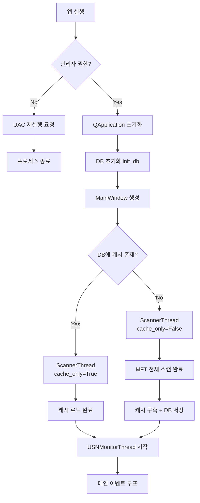
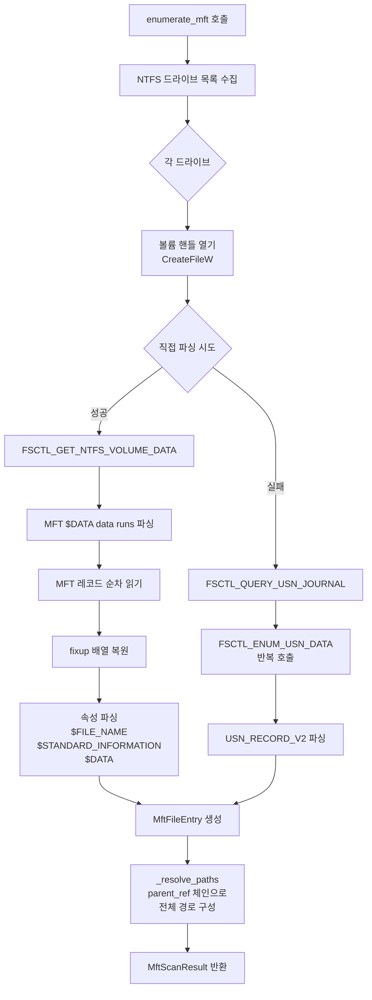
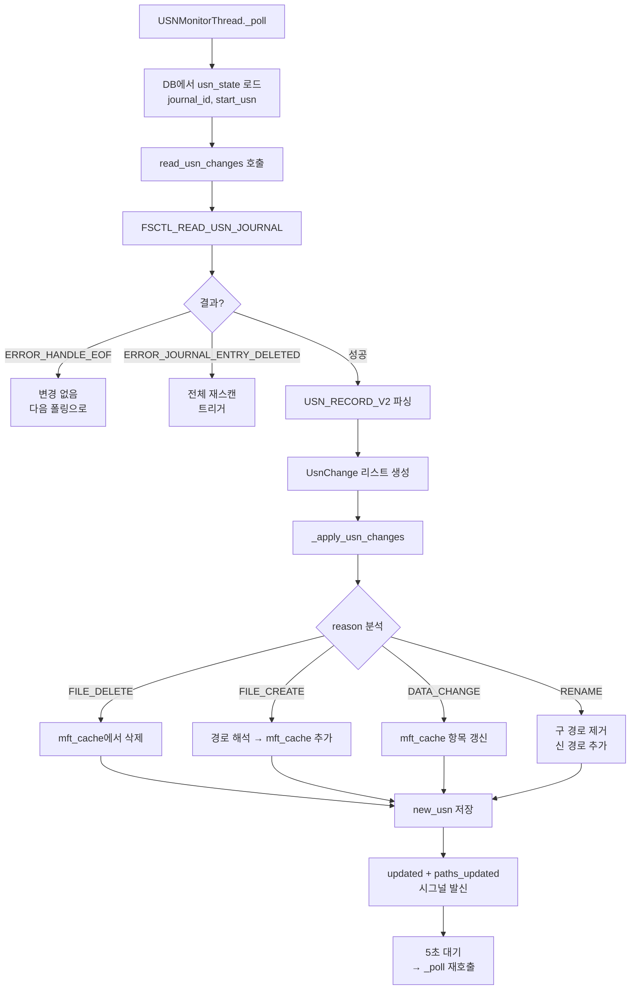
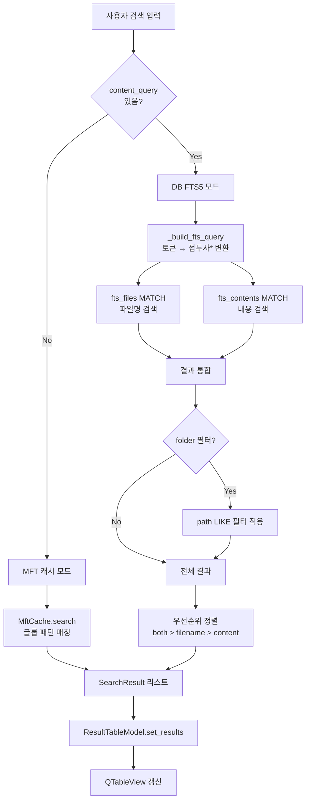
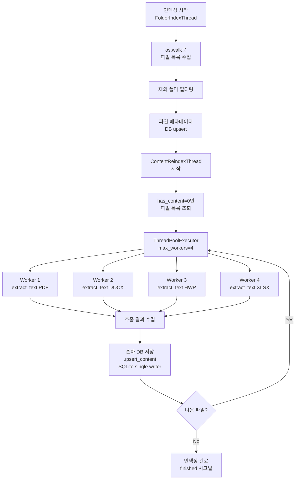
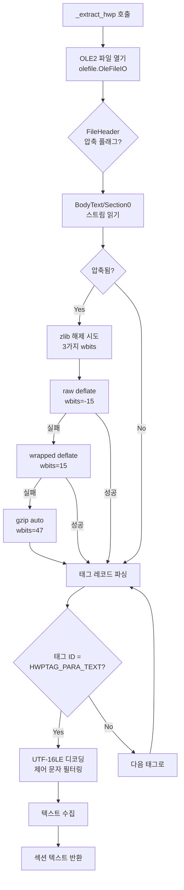

# 8강: 빌드·배포와 전체 흐름도

## 개요

이 강의에서는 SeekSeek의 빌드·배포 파이프라인을 설명하고,
마지막으로 각 핵심 기능의 **흐름도(flowchart)**를 Mermaid 다이어그램으로 정리한다.

---

## 1. 빌드 파이프라인

### PyInstaller (seekseek.spec)

SeekSeek은 **PyInstaller**를 사용하여 단일 실행 파일(또는 폴더)로 패키징한다.

```
소스 코드 (.py)
     │
     ▼
PyInstaller (seekseek.spec)
     │
     ├── Python 인터프리터 내장
     ├── 의존 패키지 수집 (PyQt6, fitz, docx, openpyxl 등)
     ├── assets 폴더 복사
     └── 실행 파일 생성
     │
     ▼
dist/seekseek/ (또는 dist/seekseek.exe)
```

### Inno Setup (installer.iss)

Windows 설치 프로그램은 **Inno Setup**으로 생성한다:

```
PyInstaller 출력 (dist/seekseek/)
     │
     ▼
Inno Setup (installer.iss)
     │
     ├── 설치 경로 설정
     ├── 시작 메뉴 바로가기
     ├── 언인스톨러 포함
     └── 인스톨러 .exe 생성
     │
     ▼
SeekSeek_Setup.exe
```

---

## 2. 의존성 관리 (requirements.txt)

```
PyQt6>=6.5          # GUI 프레임워크
PyMuPDF>=1.23       # PDF 텍스트 추출
python-docx>=0.8    # DOCX 텍스트 추출
openpyxl>=3.1       # XLSX 텍스트 추출
python-pptx>=0.6    # PPTX 텍스트 추출
olefile>=0.46       # HWP(OLE2) 파일 파싱
```

---

## 3. 관리자 권한 처리

MFT 직접 파싱과 볼륨 핸들 접근에는 **관리자 권한**이 필수다:

```python
# main.py
def _is_admin() -> bool:
    """현재 프로세스가 관리자 권한으로 실행 중인지 확인"""
    try:
        return ctypes.windll.shell32.IsUserAnAdmin()
    except:
        return False

def _relaunch_as_admin():
    """UAC 대화상자를 표시하여 관리자 권한으로 재실행"""
    ctypes.windll.shell32.ShellExecuteW(
        None, "runas",
        sys.executable,       # python.exe 경로
        " ".join(sys.argv),   # 인자
        None, 1               # SW_SHOWNORMAL
    )
    sys.exit()
```

---

## 4. 전체 흐름도 (Mermaid Diagrams)

### 4.1. 앱 시작 흐름



### 4.2. MFT 스캔 흐름



### 4.3. USN 증분 업데이트 흐름



### 4.4. 검색 흐름



### 4.5. 콘텐츠 인덱싱 흐름



### 4.6. HWP 텍스트 추출 흐름



---

## 5. 프로젝트 디렉터리 구조

```
everythingthing/
├── main.py              # 진입점 (관리자 권한 확인, QApplication)
├── config.py            # 전역 설정 (경로, 상수, 제외 목록)
├── requirements.txt     # Python 의존성
├── seekseek.spec        # PyInstaller 빌드 설정
├── installer.iss        # Inno Setup 설치 프로그램 설정
│
├── core/                # 핵심 로직
│   ├── __init__.py
│   ├── mft_scanner.py   # MFT 직접 파싱, USN Journal
│   ├── mft_cache.py     # Everything식 메모리 캐시
│   ├── indexer.py        # SQLite FTS5 DB 관리
│   ├── searcher.py       # 이중 모드 검색 엔진
│   ├── scanner.py        # QThread 워커 스레드
│   └── extractor.py      # 문서 텍스트 추출
│
├── gui/                 # GUI 계층
│   ├── __init__.py
│   ├── main_window.py   # 메인 윈도우, ResultTableModel
│   └── dialogs.py       # 설정/도움말/정보 다이얼로그
│
├── assets/              # 아이콘 등 리소스
│
└── docs/                # 문서
    ├── introduce.gif    # 소개 GIF
    ├── lectures/        # 강의 자료 (이 파일들!)
    └── tutorials/       # 실습 자료
```

---

## 참고 자료

- [PyInstaller 공식 문서](https://pyinstaller.org/)
- [Inno Setup 공식 문서](https://jrsoftware.org/isinfo.php)
- [Mermaid 다이어그램 문법](https://mermaid.js.org/)
